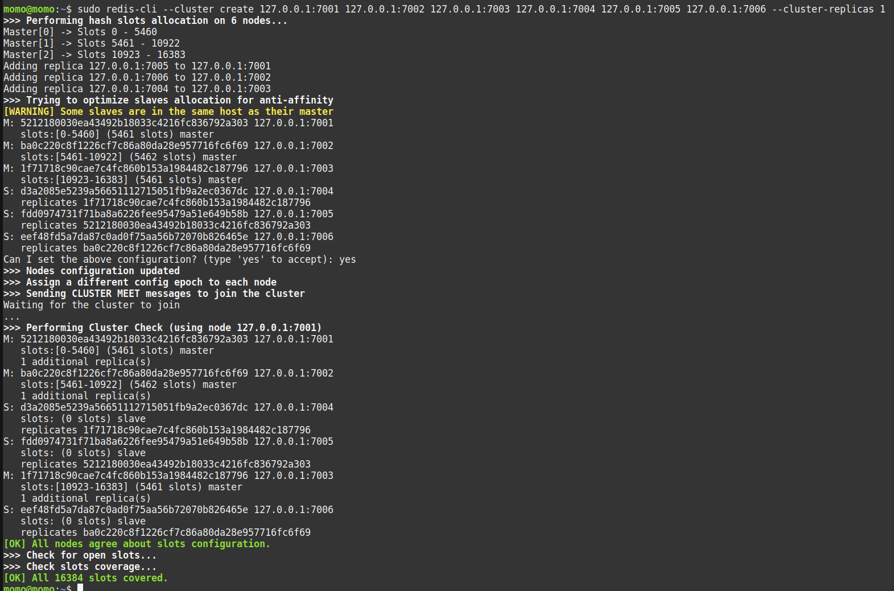

# Commands

## install Redis

```bash
sudo apt install redis-server -y
sudo systemctl restart redis.service
sudo systemctl start redis
sudo systemctl status redis
```

## commands Redis

```bash
redis-cli
27.0.0.1:6379> SET color RED
27.0.0.1:6379> SET color WHITE
27.0.0.1:6379> GET color
```

## Performance (redis-benchmark)

redis-cli -p 6379

```bash
keys *
exit

#redis-cli
redis-benchmark -h 127.0.0.1 -q -n 1000000

#free -h

#redis-cli
redis-benchmark -h 127.0.0.1 -p 6379 -q -n 1000000 -d 10 #10 bytes per records

redis-benchmark -h 127.0.0.1 -p 6379 -q -n 1000000 -d 10 -t get,set
redis-benchmark -h 127.0.0.1 -p 6379 -q -n 1000000 -d 10 -t get,set -c 5 #-c number of clients

dbsize
flushall
```

## Data Types

redis-cli

```bash
#simple values
set chair 100
get chair
keys *
del chair
set seq_id 1
incr seq_id #increment counter
get seq_id
exists seq_id #if exists
dbsize #total records

#multiple values
mset soft 100 TV 200 Bed 300
mget soft TV Bed

#TTL (expires seconds)
set color red EX 60
expire Bed 60
flushall #all clear

#lists
lpush color Red Blue White #insert from left list
lrange color 0 -1 #get list
lpush color Black
rpush color Magenta #insert right to list
#lrange | rrange color 0 -(total - secuncuence)
llen color #lenght list

#remove elements of list
lpop color
rpop color
ltrim color 0 2 #delete from 2 index onwards

#hashes
hset product chair 100 table 200 TV 300
hget product chair
hmget product chair table #get multiple elements

#sets (members)
sadd users_ip 10.0.0.1
sadd users_ip 10.0.0.2 10.0.0.3 192.168.0.0
scard users_ip
smembers users_ip
sadd yesterday_ip 10.0.0.1 192.168.0.0 10.3.4.0 192.168.0.0.3
sdiff users_ip yesterday_ip
sdiff yesterday_ip users_ip
sismember yesterday_ip 192.168.0.0 #if exists as member
smove yesterday_ip previous_ip 192.168.0.0
smembers previous_ip
smembers yesterday_ip
sadd users john martin rahul vikas henry
spop users #remove
spop users 2
srem users "john" #remove
srem users "martin" "henry"
```

## Transactions

https://www.itpanther.com/redis-transactions/

```bash
set ticket_available 4
keys *
get ticket_available
decr ticket_available

multi
get ticket_available #QUEUED
decr ticket_available #QUEUED
exec

multi
decr ticket_available #QUEUED
discard #discard transaction

watch ticket_available
multi
get ticket_available
decr ticket_available
exec
```

## Redis Insertion

https://www.itpanther.com/what-is-the-fastest-way-to-insert-data-to-redis/

```bash
cd raw_data/
awk -F ',' '{print $1}' countries.csv #print firt column (separate by comma)
awk -F ',' '{print "SET " $2 " " $1}' countries.csv > countries_to_redis.csv
wc -l countries_to_redis.csv #count lines

#insert data
cat countries_to_redis.csv | redis-cli -h localhost -p 6379
cat countries_to_redis.csv | redis-cli -h localhost -p 6379 --pipe

dbsize
```

## Backup and Restore

```bash
vim /etc/redis/redis.conf
```

## Python

```bash
cd python
cat student.csv.redis_format | redis-cli --pipe
pip3 install redis
python3 load_students_info.py 1
```

## Commands

```bash
ps -ef | grep redis
sudo redis-server /etc/redis/redis.conf &
```

## History

```bash
less ~/.rediscli_history
```

## Master and Slaves

```bash
#create slaves
cd /etc/redis

sudo cp redis.conf redis-slave-1.conf
sudo mkdir /var/lib/redis-slave-1
sudo sed -i 's/port 6379/port 6380/g' redis-slave-1.conf
sudo sed -i 's+dir /var/lib/redis+dir /var/lib/redis-slave-1+g' redis-slave-1.conf
sudo sed -i 's/# replicaof <masterip> <masterport>/replicaof 127.0.0.1 6379/g' redis-slave-1.conf
sudo sed -i 's+logfile /var/log/redis/redis-server.log+logfile /var/log/redis/redis-slave-1.log+g' redis-slave-1.conf

sudo cp redis.conf redis-slave-2.conf
sudo mkdir /var/lib/redis-slave-2
sudo sed -i 's/port 6379/port 6381/g' redis-slave-2.conf
sudo sed -i 's+dir /var/lib/redis+dir /var/lib/redis-slave-2+g' redis-slave-2.conf
sudo sed -i 's/# replicaof <masterip> <masterport>/replicaof 127.0.0.1 6379/g' redis-slave-2.conf
sudo sed -i 's+logfile /var/log/redis/redis-server.log+logfile /var/log/redis/redis-slave-2.log+g' redis-slave-2.conf

sudo cp redis.conf redis-slave-3.conf
sudo mkdir /var/lib/redis-slave-3
sudo sed -i 's/port 6379/port 6382/g' redis-slave-3.conf
sudo sed -i 's+dir /var/lib/redis+dir /var/lib/redis-slave-3+g' redis-slave-3.conf
sudo sed -i 's/# replicaof <masterip> <masterport>/replicaof 127.0.0.1 6379/g' redis-slave-3.conf
sudo sed -i 's+logfile /var/log/redis/redis-server.log+logfile /var/log/redis/redis-slave-3.log+g' redis-slave-3.conf

sudo redis-server /etc/redis/redis-slave-1.conf
sudo redis-server /etc/redis/redis-slave-2.conf
sudo redis-server /etc/redis/redis-slave-3.conf

ps -ef  | grep redis
ls /var/log/redis/
cat /var/log/redis/redis-slave-1.log

redis-cli
#into redis
lpush color Red Green Black White
lrange color 0 -1

redis-cli -p 6380
#into redis
dbsize
keys *
lrange color 0 -1
```

## High Availability with Sentinel

### Schema IP:
- Master node: 10.128.0.2
- Slave node: 10.128.0.4
- Slave node: 10.128.0.5

### Step 1:
Configure three servers where one is a master and two slaves
- Master node (redis + sentinel)
- Salves nodes (redis + sentinel)

#### Install Redis Sentinel

```bash
sudo apt install redis-sentinel -y #por by default is 26379
```

#### change configuration files

Master node

```bash
sudo sed -i 's/bind 127.0.0.1/bind 10.128.0.2/g' /etc/redis/redis.conf
sudo sed -i 's/bind 127.0.0.1 ::1/10.128.0.2/g' /etc/redis/sentinel.conf
sudo sed -i 's/sentinel monitor mymaster 127.0.0.1 6379 2/sentinel monitor mymaster 10.128.0.2 6379 2/g' /etc/redis/sentinel.conf #last params 2 is for quorum to decided promoved to master with master is down
```

Slave 1

```bash
sudo sed -i 's/bind 127.0.0.1/bind 10.128.0.4/g' /etc/redis/redis.conf
sudo sed -i 's/# replicaof <masterip> <masterport>/replicaof 10.128.0.2 6379/g' /etc/redis/redis.conf
sudo sed -i 's/bind 127.0.0.1 ::1/10.128.0.4/g' /etc/redis/sentinel.conf
sudo sed -i 's/sentinel monitor mymaster 127.0.0.1 6379 2/sentinel monitor mymaster 10.128.0.2 6379 2/g' /etc/redis/sentinel.conf
```

Slave 2

```bash
sudo sed -i 's/bind 127.0.0.1/bind 10.128.0.5/g' /etc/redis/redis.conf
sudo sed -i 's/# replicaof <masterip> <masterport>/replicaof 10.128.0.2 6379/g' /etc/redis/redis.conf
sudo sed -i 's/bind 127.0.0.1 ::1/10.128.0.5/g' /etc/redis/sentinel.conf
sudo sed -i 's/sentinel monitor mymaster 127.0.0.1 6379 2/sentinel monitor mymaster 10.128.0.2 6379 2/g' /etc/redis/sentinel.conf
```

#### Enable sentinel in servers

```bash
sudo systemctl start redis-sentinel
sudo systemctl enable redis-sentinel
sudo systemctl status redis-sentinel
```

```bash
redis-cli -h 10.128.0.2 -p 26379 #connect to master node
#view info from sentinel
sentinel master mymaster #mymaster name seted from sentinel monitor in sentinel.conf
#view log
/var/log/redis/redis-sentinel.log
```

## Replication and Failover

### Schema IP:
- Master Server: 10.128.0.4
- Slave Server: 10.128.0.5
- New Master Server (Make Server): 10.128.0.6

#### change configuration files

Master Server

```bash
sudo sed -i 's/bind 127.0.0.1/bind 10.128.0.4/g' /etc/redis/redis.conf
```

Slave Server

```bash
sudo sed -i 's/bind 127.0.0.1/bind 10.128.0.5/g' /etc/redis/redis.conf
sudo sed -i 's/# replicaof <masterip> <masterport>/replicaof 10.128.0.4 6379/g' /etc/redis/redis.conf
```

New Master Server (Make Server)

```bash
redis-cli 10.128.0.5
save #into redis, get last data to dump
sudo sed -i 's/bind 127.0.0.1/bind 10.128.0.6/g' /etc/redis/redis.conf
redis-cli 10.128.0.5 10.128.0.6 6379 #into redis, set new master for this slave
slaveof 
```

## Clustering

https://www.itpanther.com/setting-up-redis-clustering/

### Schema IP:
- Node 1: port
- Node 2: port
- Node 3: port
- Node 4: port
- Node 5: port
- Node 6: port

```bash
sudo mkdir /var/lib/redis-n1
sudo mkdir /var/lib/redis-n2
sudo mkdir /var/lib/redis-n3
sudo mkdir /var/lib/redis-n4
sudo mkdir /var/lib/redis-n5
sudo mkdir /var/lib/redis-n6

sudo tee /etc/redis/redis-n1.conf<<EOF
port 7001
cluster-enabled yes
cluster-config-file nodes.conf
cluster-node-timeout 5000
appendonly yes
EOF

sudo cp /etc/redis/redis-n1.conf /etc/redis/redis-n2.conf
sudo sed -i 's/port 7001/port 7002/g' /etc/redis/redis-n2.conf

sudo cp /etc/redis/redis-n1.conf /etc/redis/redis-n3.conf
sudo sed -i 's/port 7001/port 7003/g' /etc/redis/redis-n3.conf

sudo cp /etc/redis/redis-n1.conf /etc/redis/redis-n4.conf
sudo sed -i 's/port 7001/port 7004/g' /etc/redis/redis-n4.conf

sudo cp /etc/redis/redis-n1.conf /etc/redis/redis-n5.conf
sudo sed -i 's/port 7001/port 7005/g' /etc/redis/redis-n5.conf

sudo cp /etc/redis/redis-n1.conf /etc/redis/redis-n6.conf
sudo sed -i 's/port 7001/port 7006/g' /etc/redis/redis-n6.conf

cat /etc/redis/redis-n*

sudo mkdir /etc/redis/700{1..6}
sudo mv /etc/redis/redis-n1.conf /etc/redis/7001
sudo mv /etc/redis/redis-n2.conf /etc/redis/7002
sudo mv /etc/redis/redis-n3.conf /etc/redis/7003
sudo mv /etc/redis/redis-n4.conf /etc/redis/7004
sudo mv /etc/redis/redis-n5.conf /etc/redis/7005
sudo mv /etc/redis/redis-n6.conf /etc/redis/7006

cd /etc/redis/7001/ && sudo redis-server redis-n1.conf &
cd /etc/redis/7002/ && sudo redis-server redis-n2.conf &
cd /etc/redis/7003/ && sudo redis-server redis-n3.conf &
cd /etc/redis/7004/ && sudo redis-server redis-n4.conf &
cd /etc/redis/7005/ && sudo redis-server redis-n5.conf &
cd /etc/redis/7006/ && sudo redis-server redis-n6.conf &

ps -ef | grep redis

sudo redis-cli --cluster create 127.0.0.1:7001 127.0.0.1:7002 127.0.0.1:7003 127.0.0.1:7004 127.0.0.1:7005 127.0.0.1:7006 --cluster-replicas 1
```




### Connecting to Redis-CLI with Cluster Aware

```bash
redis-cli -c -p 7001

 #into redis
set foo bar
set hello word
get foo
```


```bash
redis-cli --cluster check 127.0.0.1:7001
redis-cli -p 7001 cluster nodes
redis-cli -p 7001 shutdown
redis-cli --cluster check 127.0.0.1:7003
```